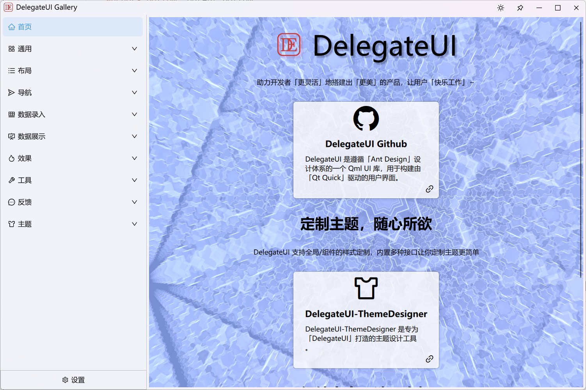
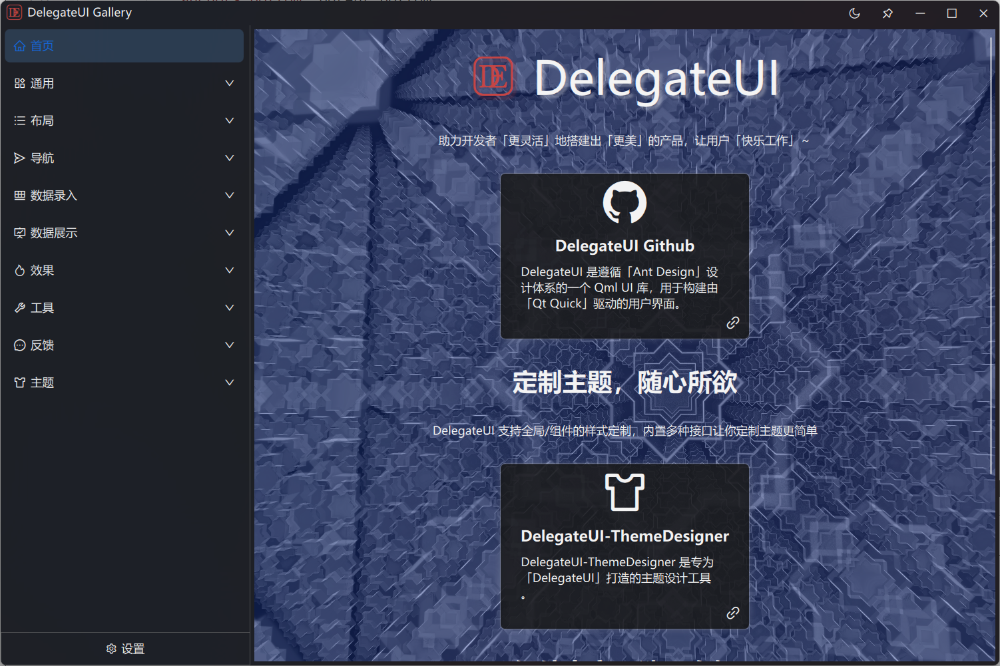
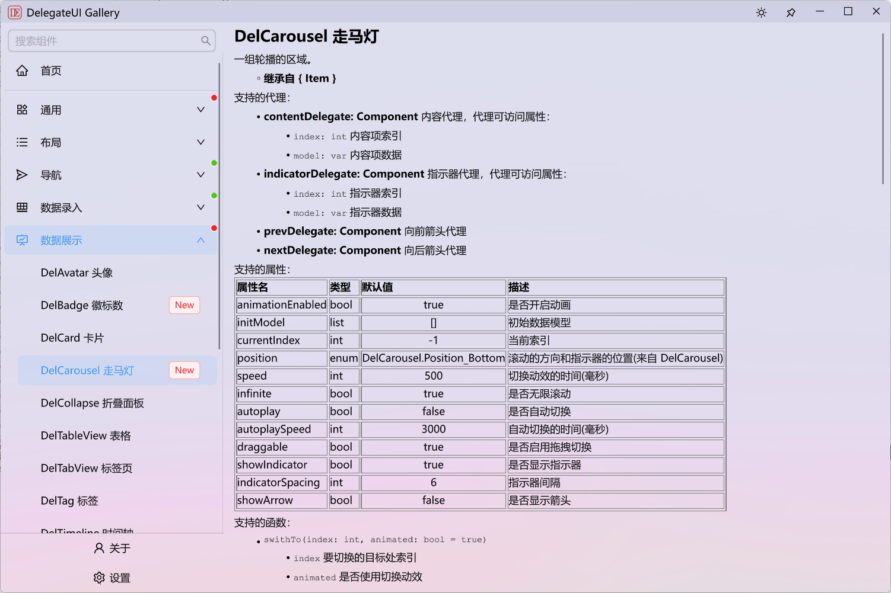

<div align=center>


# 「 HuskarUI 」 基于 Qml 的现代 UI

Qt Qml 的 Ant 设计组件库

如果你需要 Qt5 实现 [HuskarUI for Qt5](https://github.com/mengps/HuskarUI_Qt5)

</div>

<div align=center>

![win-badge] ![linux-badge] ![macos-badge] ![android-badge]

[![Issues][issues-open-image]][issues-open-url] [![Issues][issues-close-image]][issues-close-url] [![Release][release-image]][release-url]

[![QQGroup][qqgroup-image]][qqgroup-url]

[English](./README.md) | 中文

</div>

[win-badge]: https://img.shields.io/badge/Windows-passing-brightgreen?style=flat-square
[linux-badge]: https://img.shields.io/badge/Linux-passing-brightgreen?style=flat-square
[macos-badge]: https://img.shields.io/badge/MacOS-passing-brightgreen?style=flat-square
[android-badge]: https://img.shields.io/badge/Android-passing-brightgreen?style=flat-square

[issues-open-image]: https://img.shields.io/github/issues/mengps/HuskarUI?label=Issue&style=flat-square
[issues-open-url]: https://github.com/mengps/HuskarUI/issues
[issues-close-image]: https://img.shields.io/github/issues-closed/mengps/HuskarUI?color=brightgreen&label=Issue&style=flat-square
[issues-close-url]: https://github.com/mengps/HuskarUI/issues?q=is%3Aissue%20state%3Aclosed

[release-image]: https://img.shields.io/github/v/release/mengps/HuskarUI?label=Release&style=flat-square
[release-url]: https://github.com/mengps/HuskarUI/releases

[qqgroup-image]: https://img.shields.io/badge/QQGroup-490328047-f74658?style=flat-square
[qqgroup-url]: https://qm.qq.com/q/cMNHn2tWeY

<div align=center>

## 🌈 陈列室预览





</div>

## ✨ 特性

- 📦 一套开箱即用的优质 Qml 组件.
- 🎨 强大的主题定制系统.
- 💻 基于Qml，完全跨平台.
- 🔧 高度灵活的基于委托的组件定制.

## 🗺️ 路线图

开发计划可以在这里看到: [组件路线图](https://github.com/mengps/HuskarUI/discussions/5).

任何人都可以通过 issue/qq群/wx群 进行讨论, 最终有意义的组件/功能将添加到开发计划.

## 🌐 在线 wiki
- [HuskarUI 在线 wiki (AI)](https://deepwiki.com/mengps/HuskarUI)

## 📺 在线演示

  - [哔哩哔哩](https://www.bilibili.com/video/BV1jodhYhE8a/?spm_id_from=333.1387.homepage.video_card.click)

## 🗂️ 预编译包

预编译了两个平台的 `Windows / Linux` 程序包和二进制库包.

前往 [Release](https://github.com/mengps/HuskarUI/releases) 中下载.

## 🔨 如何构建

- 克隆
```auto
git clone --recursive https://github.com/mengps/HuskarUI.git
```
- 构建
```cmake
cd HuskarUI
cmake -S . -B build
cmake --build build --config Release --target all --parallel
```

- 使用 MinGW 构建
```cmake
cmake -S . -B build -G "Ninja"
or
cmake -S . -B build -G "MinGW Makefiles"
```
> [!IMPORTANT]
> 默认情况下，`BUILD_HUSKARUI_IN_DEFAULT_LOCATION=ON`:
> - `headers` 将构建在 `[QtDir]/[QtVersion]/[Kit]/include/HuskarUI` 目录中。
> - `*.dll/*.so` 将构建在 `[QtDir]/[QtVersion]/[Kit]/bin` 目录中。
> - `*.lib` 将构建在 `[QtDir]/[QtVersion]/[Kit]/lib` 目录中。
> - `plugin` 将构建在 `[QtDir]/[QtVersion]/[Kit]/qml/HuskarUI` 目录中。

- 安装
```cmake
cmake --install --prefix <install_dir>
```
安装目录结构
```auto
──<install_dir>
    ├─include
    │   *.h
    ├─bin
    │   *.dll
    ├─lib
    │   *.lib/so
    └─imports
        └─HuskarUI/Basic
```
- 使用
  - 链接 `<install_dir>/lib`.
  - 包含 `<install_dir>/include`.
  - 复制 `<install_dir>/bin/HuskarUIBasic.[dll/so]` 到 `[QtDir]/[QtVersion]/[Kit]/bin`.
  - 复制 `<install_dir>/imports/HuskarUI` 到 `[QtDir]/[QtVersion]/[Kit]/qml`.

## 📦 上手

 - 创建 QtQuick 应用 `QtVersion >= 6.7`
 - 添加下面的 cmake 命令到您的项目 `CMakeLists.txt` 中
 ```cmake
  target_include_directories(<your_target> PRIVATE HuskarUI/include)
  target_link_directories(<your_target> PRIVATE HuskarUI/lib)
  target_link_libraries(<your_target> PRIVATE HuskarUIBasic)
 ```
 - 添加下面的代码到您的 `main.cpp` 中
 ```cpp
  #include "husapp.h"

  int main(int argc, char *argv[])
  {
      ...
      /*! 设置 OpenGL, 可选 */
      QQuickWindow::setGraphicsApi(QSGRendererInterface::OpenGL);
      QQuickWindow::setDefaultAlphaBuffer(true);
      ...
      QGuiApplication app(argc, argv);
      QQmlApplicationEngine engine;
      HusApp::initialize(&engine);
      ...
  }
 ```
 - 添加下面的代码到您的 `.qml` 中
 ```qml
  import HuskarUI.Basic
  HusWindow { 
    ...
  }
 ```
好了，你现在可以愉快的开始使用 HuskarUI 了。

## 🚩 参考

- Ant-d 组件: https://ant-design.antgroup.com/components/overview-cn
- Ant 设计: https://ant-design.antgroup.com/docs/spec/introduce-cn

## 💓 许可证

使用 `MIT LICENSE`

## 🌇 环境

Windows 11 / Ubuntu 24.04.2, Qt Version >= 6.7

## 🎉 Star 历史

[](https://star-history.com/#mengps/HuskarUI&Date)