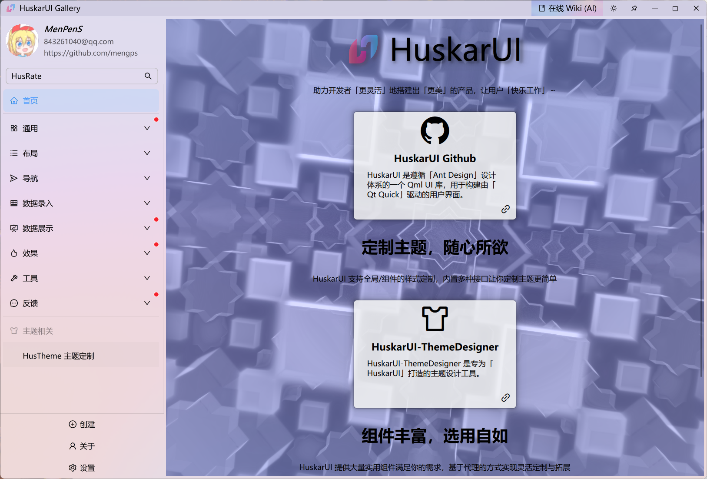

<div align=center>


# 「 DelegateUI 」 基于 Qml 的现代 UI

Qt Qml 的 Ant 设计组件库

如果你需要 Qt5 实现 [DelegateUI for Qt5](https://github.com/mengps/QmlControls)

</div>

<div align=center>

![win-badge] ![linux-badge] [![Issues][issues-image]][issues-url] [![QQGroup][qqgroup-image]][qqgroup-url]

[English](./README.md) | 中文

</div>

[win-badge]: https://img.shields.io/badge/Windows-passing-brightgreen?style=flat-square
[linux-badge]: https://img.shields.io/badge/Linux-passing-brightgreen?style=flat-square

[issues-image]: https://flat.badgen.net/github/label-issues/mengps/DelegateUI/open
[issues-url]: https://github.com/mengps/DelegateUI/issues

[qqgroup-image]: https://img.shields.io/badge/QQ群-490328047-f74658?style=flat-square
[qqgroup-url]: https://qm.qq.com/q/cMNHn2tWeY

<div align=center>

## 🌈 陈列室预览




</div>

## ✨ 特性

- 📦 一套开箱即用的优质 Qml 组件.
- 🎨 强大的主题定制系统.
- 💻 基于Qml，完全跨平台.

## 🔨 如何构建

- 克隆
```auto
git clone --recursive https://github.com/mengps/DelegateUI.git
```
- 构建
```cmake
cd DelegateUI
cmake -S . -B build 
cmake --build build --config Release --target all --parallel
```
默认情况下，`plugin` 将构建在 `[QtDir]/[QtVersion]/[Kit]/qml/DeleagetUI` 目录中。
- 安装
```cmake
cmake --intall --prefix <install_dir>
```
安装目录结构
```auto
──<install_dir>
    ├─include
    │   *.h
    ├─bin
    │   *.dll/so
    ├─lib
    │   *.lib
    └─imports
        └─DeleagetUI
```
- 使用
  - 链接 `<install_dir>/lib`.
  - 包含 `<install_dir>/include`.
  - 复制 `<install_dir>/bin/DeleagetUI.[dll/so]` 到 `[QtDir]/[QtVersion]/[Kit]/bin`.
  - 复制 `<install_dir>/imports/DeleagetUI` 到 `[QtDir]/[QtVersion]/[Kit]/qml`.

## 📦 上手

 - 创建 QtQuick 应用 `QtVersion >= 6.5`
 - 添加下面的 cmake 命令到您的项目 `CMakeLists.txt` 中
 ```cmake
  target_include_directories(<your_target> PRIVATE DelegateUI/include)
  target_link_directories(<your_target> PRIVATE DelegateUI/lib)
  target_link_libraries(<your_target> PRIVATE DelegateUI)
 ```
 - 添加下面的代码到您的 `main.cpp` 中
 ```cpp
  #include "delapp.h"

  int main(int argc, char *argv[])
  {
      ...
      QQuickWindow::setGraphicsApi(QSGRendererInterface::OpenGL);
      QQuickWindow::setDefaultAlphaBuffer(true);
      ...
      QGuiApplication app(argc, argv);
      QQmlApplicationEngine engine;
      DelApp::initialize(&engine);
      ...
  }
 ```
 - 添加下面的代码到您的 `.qml` 中
 ```qml
  import DelegateUI
  DelWindow { 
    ...
  }
 ```
好了，你现在可以愉快的开始使用 DelegateUI 了。

## 🚩 参考

- Ant-d 组件: https://ant-design.antgroup.com/components/overview-cn
- Ant 设计: https://ant-design.antgroup.com/docs/spec/introduce-cn

## 💓 许可证

使用 `MIT LICENSE`

## 🌇 环境

Windows 11 / Ubuntu 24.04.2, Qt Version >= 6.5

## 🎉 Star 历史

[](https://star-history.com/#mengps/DelegateUI&Date)