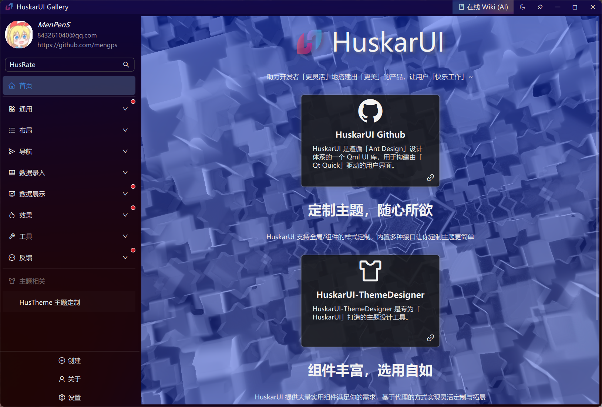

<div align=center>


# 「 DelegateUI 」 基于 Qml 的现代 UI

Qt Qml 的 Ant 设计组件库

如果你需要 Qt5 实现 [DelegateUI for Qt5](https://github.com/mengps/QmlControls)

</div>

<div align=center>

![win-badge] [![Issues][issues-image]][issues-url]

[English](./README.md) | 中文

</div>

[win-badge]: https://img.shields.io/badge/Windows-passing-brightgreen?style=flat-square

[issues-image]: https://flat.badgen.net/github/label-issues/mengps/DelegateUI/open
[issues-url]: https://github.com/mengps/DelegateUI/issues

<div align=center>

## 🌈 陈列室预览




</div>

## ✨ 特性

- 📦 一套开箱即用的优质 Qml 组件.
- 🎨 强大的主题定制系统.

## 🔨 如何构建

- 克隆
```auto
git clone --recursive https://github.com/mengps/DelegateUI.git
```
- 构建
```cmake
cd DelegateUI
cmake -S . -B build 
cmake --build build --config Release --target all --parallel
```
- 安装
```cmake
cmake --intall --prefix <install_dir>
```

## 参考

Ant 设计: https://ant-design.antgroup.com/docs/spec/introduce-cn

## 💓 许可证

Use `MIT LICENSE`

## 🌇 环境

Windows 11, Qt Version >= 6.5