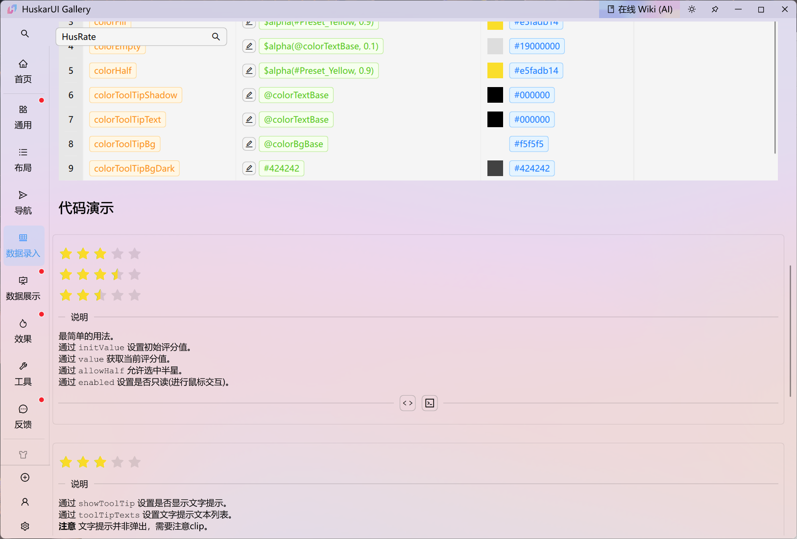

<div align=center>


# 「 HuskarUI 」 基于 Qml 的现代 UI

Qt Qml 的 Ant 设计组件库

如果你需要 Python 实现 [HuskarUI for PySide6](https://github.com/mengps/PyHuskarUI)

如果你需要 Qt5 实现 [HuskarUI for Qt5](https://github.com/mengps/HuskarUI_Qt5)

</div>

<div align=center>

![win-badge] ![linux-badge] ![macos-badge] ![android-badge]

[![Issues][issues-open-image]][issues-open-url] [![Issues][issues-close-image]][issues-close-url] [![Release][release-image]][release-url]

[![QQGroup][qqgroup-image]][qqgroup-url]

[English](./README.md) | 中文

</div>

[win-badge]: https://img.shields.io/badge/Windows-passing-brightgreen?style=flat-square
[linux-badge]: https://img.shields.io/badge/Linux-passing-brightgreen?style=flat-square
[macos-badge]: https://img.shields.io/badge/MacOS-passing-brightgreen?style=flat-square
[android-badge]: https://img.shields.io/badge/Android-passing-brightgreen?style=flat-square

[issues-open-image]: https://img.shields.io/github/issues/mengps/HuskarUI?label=Issue&style=flat-square
[issues-open-url]: https://github.com/mengps/HuskarUI/issues
[issues-close-image]: https://img.shields.io/github/issues-closed/mengps/HuskarUI?color=brightgreen&label=Issue&style=flat-square
[issues-close-url]: https://github.com/mengps/HuskarUI/issues?q=is%3Aissue%20state%3Aclosed

[release-image]: https://img.shields.io/github/v/release/mengps/HuskarUI?label=Release&style=flat-square
[release-url]: https://github.com/mengps/HuskarUI/releases

[qqgroup-image]: https://img.shields.io/badge/QQGroup-490328047-f74658?style=flat-square
[qqgroup-url]: https://qm.qq.com/q/cMNHn2tWeY

<div align=center>

## 🌈 陈列室预览




</div>

## ✨ 特性

- 📦 一套开箱即用的优质 Qml 组件.
- 🎨 强大的主题定制系统.
- 💻 基于Qml，完全跨平台.
- 🔧 高度灵活的基于委托的组件定制.

## 🗺️ 路线图

开发计划可以在这里看到: [组件路线图](https://github.com/mengps/HuskarUI/discussions/5).

任何人都可以通过 issue/qq群/wx群 进行讨论, 最终有意义的组件/功能将添加到开发计划.

## 🌐 在线 wiki
- [HuskarUI 在线 wiki (AI)](https://deepwiki.com/mengps/HuskarUI)

## 📺 在线演示

  - [哔哩哔哩](https://www.bilibili.com/video/BV1jodhYhE8a/?spm_id_from=333.1387.homepage.video_card.click)

## 🗂️ 预编译包

预编译了两个平台的 `Windows / Linux` 程序包和二进制库包.

前往 [Release](https://github.com/mengps/HuskarUI/releases) 中下载.

## 🔨 如何构建

- 克隆
```auto
git clone --recursive https://github.com/mengps/HuskarUI.git
```
- 构建 & 安装
  - Windows - Visual Studio
  ```sh
  cd HuskarUI
  cmake -DCMAKE_PREFIX_PATH=<QT_DIR> -G "Visual Studio <version>" -B build -S . 
  cmake --build build --config Release --target ALL_BUILD INSTALL --parallel
  ```
  - All - Ninja
  ```sh
  cd HuskarUI
  cmake -DCMAKE_PREFIX_PATH=<QT_DIR> -G "Ninja" -B build -S . 
  cmake --build build --config Release --target all install --parallel
  ```

> [!IMPORTANT]
> 默认情况下, `INSTALL_HUSKARUI_IN_DEFAULT_LOCATION=ON`:
> - `headers` 将安装在  `[QtDir]/[QtVersion]/[Kit]/include/HuskarUI` 目录中.
> - `*.dll/*.so` 将安装在  `[QtDir]/[QtVersion]/[Kit]/bin` 目录中.
> - `*.lib` 将安装在  `[QtDir]/[QtVersion]/[Kit]/lib` 目录中.
> - `qmlplugin` 将安装在 `[QtDir]/[QtVersion]/[Kit]/qml` 目录中.
> 
> 如果您想改变安装目录, 请将 `INSTALL_HUSKARUI_IN_DEFAULT_LOCATION` 设置为 `OFF` 并在 cmake 中设置 `HUSKARUI_INSTALL_DIRECTORY`.
> ```sh
> cmake -DCMAKE_PREFIX_PATH=<QT_DIR> \
>   -DINSTALL_HUSKARUI_IN_DEFAULT_LOCATION=OFF \
>   -DHUSKARUI_INSTALL_DIRECTORY=<install_dir> \
>   -G "Ninja" -B build -S .
> ```

安装目录结构
```auto
──<install_dir>
    ├─include
    │   └─HuskarUI/*.h
    ├─bin
    │   *.dll
    ├─lib
    │   *.lib/so
    │   └─cmake/*.cmake
    └─qml
        └─HuskarUI/Basic
```
- 用法
  - 使用 cmake
    添加下面的 cmake 命令到您项目的 `CMakeLists.txt` 中
    ```cmake
    find_package(HuskarUI REQUIRED)
    target_link_libraries(<your_target> HuskarUI::Basic)
    ```
  - 直接使用库
    - 链接`<install_dir>/lib`.
    - 包含 `<install_dir>/include`.
    - [可选] 复制 `<install_dir>/bin/HuskarUIBasic.[dll/so]` 到 `[QtDir]/[QtVersion]/[Kit]/bin`.
    - 复制 `<install_dir>/qml/HuskarUI` 到 `[QtDir]/[QtVersion]/[Kit]/qml`.

## 📦 上手

 - 创建 QtQuick 应用 `QtVersion >= 6.7`
 - 添加下面的代码到您的 `main.cpp` 中
 ```cpp
  #include "HuskarUI/husapp.h"

  int main(int argc, char *argv[])
  {
      ...
      /*! 设置 OpenGL, 可选 */
      QQuickWindow::setGraphicsApi(QSGRendererInterface::OpenGL);
      QQuickWindow::setDefaultAlphaBuffer(true);
      ...
      QGuiApplication app(argc, argv);
      QQmlApplicationEngine engine;
      HusApp::initialize(&engine);
      ...
  }
 ```
 - 添加下面的代码到您的 `.qml` 中
 ```qml
  import HuskarUI.Basic
  HusWindow { 
    ...
  }
 ```
好了，你现在可以愉快的开始使用 HuskarUI 了。

## 🚩 参考

- Ant-d 组件: https://ant-design.antgroup.com/components/overview-cn
- Ant 设计: https://ant-design.antgroup.com/docs/spec/introduce-cn

## 💓 许可证

使用 `MIT LICENSE`

## 🌇 环境

Windows 11 / Ubuntu 24.04.2, Qt Version >= 6.7

## 🎉 Star 历史

[](https://star-history.com/#mengps/HuskarUI&Date)